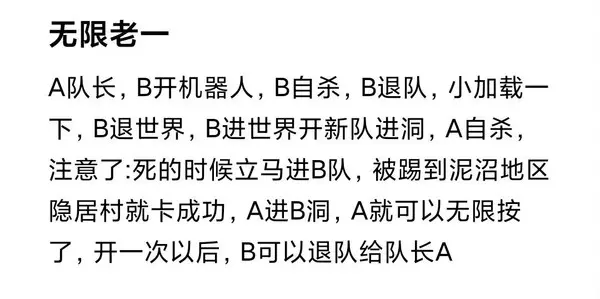
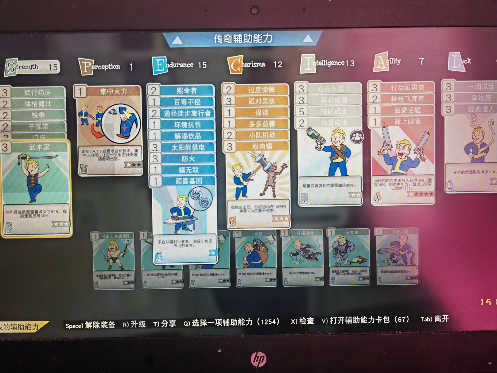

# 1. 技术储备

## 1.1. Mod

### 1.1.1. 撞火

### 1.1.2. 穿墙

### 1.1.3. 卡Ap

## 1.2. 武器

### 1.2.1. 重武器

* 等离子加特林
* 特斯拉炮

### 1.2.2. 近战武器

* 长手套: 狂怒 强力 力 捣
* 等切: 狂 强 损 捣

# 2. 突袭

## 2.1. 无限老一

无限老一卡法~ 车头脚本13-15s按按钮 没打结算窗口去除mod的 记得在脚本里面加个Tab动作 不会整脚本的戳群主 或者常驻车头

单人

开队-进洞-跳电-退队-隐蔽村活-任务出现俩深渊代表成功-建队或者不建队都可以-进本刷

### 2.1.1. Mod

* 近战
* 飞天
* meshes{EN06偷鸡} 放大护盾

力量配卡

## 2.2. 无限蛇

蛇20秒才能打人，最好可以在20秒内消灭蛇。

### 2.2.1. 需进度

需要最后boss的进度.

#### 2.2.1.1. 大枪流

#### 2.2.1.2. 近战流

### 2.2.2. 无需进度

通过飞天穿墙mod飞到大蛇面前快速打死蛇。10秒内打死。
