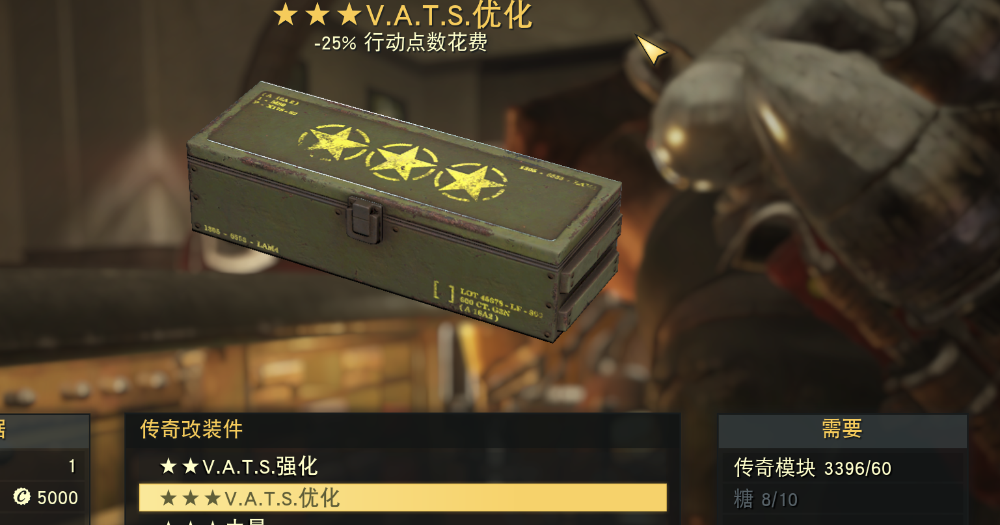

# 1. 概述

&emsp;&emsp;本文对76的数据加以分析，达到可以辅助开发。
&emsp;&emsp;目前整个开源环境中能处理“辐射76”数据的只有xEdit一个，可能是考虑的到B社对76的官方申明不支持Mod之类的说法，但是市面上Mod也是很多的。

# 2. 数据来源

&emsp;&emsp;目前数据的主要来源都是基于xEdit的脚本，这里面主要就是fo76-dumps和一些地图的数据。

https://ryan-rsm-mckenzie.github.io/bsa/

## 2.1. fo76-dumps

[来源](https://github.com/FWDekker/fo76-dumps/wiki/List-of-dumps)

**2024年10月升级了脚本从4.0.0到4.0.1这个升级大大提高了速度,从5小时降到2小时。**

* 主数据

获取每个表的行数

```SQL
ANALYZE;
select  DISTINCT tbl_name, CASE WHEN stat is null then 0 else cast(stat as INT) END numrows 
from sqlite_master m 
LEFT JOIN sqlite_stat1 stat on   m.tbl_name = stat.tbl 
where m.type='table'
and m.tbl_name not like 'sqlite_%'
order by 2;
```

| Filename             | Dump script                                                                                                     | Description                                      |
| -------------------- | --------------------------------------------------------------------------------------------------------------- | ------------------------------------------------ |
| `tabular.IDs.csv`  | [`ExportTabularIDs.pas`](https://github.com/FWDekker/fo76-dumps/blob/main/Edit%20scripts/ExportTabularIDs.pas)   | Form IDs, editor IDs, names, and keywords        |
| `tabular.ALCH.csv` | [`ExportTabularALCH.pas`](https://github.com/FWDekker/fo76-dumps/blob/main/Edit%20scripts/ExportTabularALCH.pas) | Ingestibles                                      |
| `tabular.ARMO.csv` | [`ExportTabularARMO.pas`](https://github.com/FWDekker/fo76-dumps/blob/main/Edit%20scripts/ExportTabularARMO.pas) | Armor and clothing                               |
| `tabular.CLAS.csv` | [`ExportTabularCLAS.pas`](https://github.com/FWDekker/fo76-dumps/blob/main/Edit%20scripts/ExportTabularCLAS.pas) | Class properties                                 |
| `tabular.COBJ.csv` | [`ExportTabularCOBJ.pas`](https://github.com/FWDekker/fo76-dumps/blob/main/Edit%20scripts/ExportTabularCOBJ.pas) | Craftable object recipes and components          |
| `tabular.ENTM.csv` | [`ExportTabularENTM.pas`](https://github.com/FWDekker/fo76-dumps/blob/main/Edit%20scripts/ExportTabularENTM.pas) | Atomic Shop unlockables                          |
| `tabular.FACT.csv` | [`ExportTabularFACT.pas`](https://github.com/FWDekker/fo76-dumps/blob/main/Edit%20scripts/ExportTabularFACT.pas) | Factions and vendors                             |
| `tabular.FLOR.csv` | [`ExportTabularFLOR.pas`](https://github.com/FWDekker/fo76-dumps/blob/main/Edit%20scripts/ExportTabularFLOR.pas) | Harvestable plants                               |
| `tabular.GLOB.csv` | [`ExportTabularGLOB.pas`](https://github.com/FWDekker/fo76-dumps/blob/main/Edit%20scripts/ExportTabularGLOB.pas) | Global variables                                 |
| `tabular.GMST.csv` | [`ExportTabularGMST.pas`](https://github.com/FWDekker/fo76-dumps/blob/main/Edit%20scripts/ExportTabularGMST.pas) | Game settings                                    |
| `tabular.LVLI.csv` | [`ExportTabularLVLI.pas`](https://github.com/FWDekker/fo76-dumps/blob/main/Edit%20scripts/ExportTabularLVLI.pas) | Leveled lists                                    |
| `tabular.MISC.csv` | [`ExportTabularMISC.pas`](https://github.com/FWDekker/fo76-dumps/blob/main/Edit%20scripts/ExportTabularMISC.pas) | Inventory item weights, values, and scrap yields |
| `tabular.NPC_.csv` | [`ExportTabularNPC_.pas`](https://github.com/FWDekker/fo76-dumps/blob/main/Edit%20scripts/ExportTabularNPC_.pas) | NPC factions, keywords, stats, etc.              |
| `tabular.OMOD.csv` | [`ExportTabularOMOD.pas`](https://github.com/FWDekker/fo76-dumps/blob/main/Edit%20scripts/ExportTabularOMOD.pas) | Armor and weapon mods                            |
| `tabular.OTFT.csv` | [`ExportTabularOTFT.pas`](https://github.com/FWDekker/fo76-dumps/blob/main/Edit%20scripts/ExportTabularOTFT.pas) | Outfits                                          |
| `tabular.RACE.csv` | [`ExportTabularRACE.pas`](https://github.com/FWDekker/fo76-dumps/blob/main/Edit%20scripts/ExportTabularRACE.pas) | Race keywords and properties                     |
| `tabular.WEAP.csv` | [`ExportTabularWEAP.pas`](https://github.com/FWDekker/fo76-dumps/blob/main/Edit%20scripts/ExportTabularWEAP.pas) | Weapons                                          |

* WIKI 数据| Wiki Filename      | Dump script                                                                                               | Description |
  | ------------------ | --------------------------------------------------------------------------------------------------------- | ----------- |
  | `wiki.BOOK.wiki` | [`ExportWikiBOOK.pas`](https://github.com/FWDekker/fo76-dumps/blob/main/Edit%20scripts/ExportWikiBOOK.pas) | Notes       |
  | `wiki.DIAL.wiki` | [`ExportWikiDIAL.pas`](https://github.com/FWDekker/fo76-dumps/blob/main/Edit%20scripts/ExportWikiDIAL.pas) | Dialogue    |
  | `wiki.NOTE.wiki` | [`ExportWikiNOTE.pas`](https://github.com/FWDekker/fo76-dumps/blob/main/Edit%20scripts/ExportWikiNOTE.pas) | Holodisks   |
  | `wiki.TERM.wiki` | [`ExportWikiTERM.pas`](https://github.com/FWDekker/fo76-dumps/blob/main/Edit%20scripts/ExportWikiTERM.pas) | Terminals   |
* 原始数据

| Raw Filename            | Source archive                 | Archive path              | Description                                                   |
| ----------------------- | ------------------------------ | ------------------------- | ------------------------------------------------------------- |
| `raw.credits.txt`     | `SeventySix - Interface.ba2` | `interface/credits.txt` | Credits                                                       |
| `raw.curvetables.zip` | `SeventySix - Startup.ba2`   | `misc/curvetables/json` | [Curve tables](https://github.com/FWDekker/fallout-curve-tables) |

# 3. 数据分析

## 3.1. 特殊物品判断

### 3.1.1. 金条物品

   [WiKi](https://fallout.fandom.com/wiki/Gold_bullion)
   特勤护甲

### 3.1.2. 原子物品

### 3.1.3. 邮票物品

### 3.1.4. 原子或金条

### 3.1.5. 原子或邮票

自动斧
冰冷鉄肩
005527d0
例如荆棘甲 0052AEBF 有Gold Bullion Value

## 3.2. 传奇词条

* [武器](https://fallout.fandom.com/wiki/Fallout_76_legendary_weapon_effects)
* [护甲](https://fallout.fandom.com/wiki/Fallout_76_legendary_armor_effects)

### 3.2.1. 数据分析

#### 3.2.1.1. V.A.T.S.优化(00786f88)



* ids:

```
"SeventySix.esm", "MISC", "00786f88", "LegendaryShard_Weapon3_VATSCostAP", "???V.A.T.S.优化", "[""BlockSuperDuperPerk [KYWD:0043C439]"",""FeaturedItem [KYWD:001B3FAC]"",""LegendaryShardKeyword [KYWD:00798DC4]"",""NoAutoScrapJunk [KYWD:004ECBA8]"",""NoAutoScrapJunk_ScrapAllJunk [KYWD:005576FA]""
```

* misc

```
"SeventySix.esm", "00786f88", "LegendaryShard_Weapon3_VATSCostAP", "???V.A.T.S.优化", "1.000000", "5000", "[]"
```

+ omod

```
"SeventySix.esm", "00524154", "mod_Legendary_Weapon3_VATSCostAP", "V.A.T.S.优化", "", "Weapon", "", "ap_Legendary3 ""传奇改装件 ???"" [KYWD:004E89A9]", "[]", "[{""Mod"":""_PARENT_mod_Legendary_Weapon_WEIGHTVALUE_3 [OMOD:004519F6]"",""Minimum Level"":""0"",""Optional"":""False"",""Don't Use All"":""True""}]", "[{""Value Type"":""Float"",""Function Type"":""ADD"",""Property"":""MaxRange"",""Value 1"":""0.000000"",""Value 2"":""0.000000"",""Curve Table"":""NULL - Null Reference [00000000]""},{""Value Type"":""Float"",""Function Type"":""MUL+ADD"",""Property"":""AttackActionPointCost"",""Value 1"":""-0.250000"",""Value 2"":""0.000000"",""Curve Table"":""NULL - Null Reference [00000000]""},{""Value Type"":""FormID,Int"",""Function Type"":""ADD"",""Property"":""Keywords"",""Value 1"":""FeaturedItem [KYWD:001B3FAC]"",""Value 2"":""2"",""Curve Table"":""NULL - Null Reference [00000000]""}]", "[""ma_legendarycrafting_weapon \""武器\"" [KYWD:00787E6E]""]"
```

| Field               | Content                                                     |
| ------------------- | ----------------------------------------------------------- |
| File                | SeventySix.esm                                              |
| Form ID             | 00524154                                                    |
| Editor ID           | mod_Legendary_Weapon3_VATSCostAP                            |
| Name                | V.A.T.S.优化                                                |
| Description         |                                                             |
| Form type           | Weapon                                                      |
| Loose mod           |                                                             |
| Attach point        | ap_Legendary3 "传奇改装件 ???" [KYWD:004E89A9]              |
| Attach parent slots | []                                                          |
| Includes            | 见下面的Json                                                |
| Properties          | 见下面的Json                                                |
| Target keywords     | [""ma_legendarycrafting_weapon\""武器\"" [KYWD:00787E6E]""] |

* Includes:

```json
[
    {
        "Mod": "_PARENT_mod_Legendary_Weapon_WEIGHTVALUE_3 [OMOD:004519F6]",
        "Minimum Level": "0",
        "Optional": "False",
        "Don't Use All": "True"
    }
]
```

Properties:

```json
[
    {
        "Value Type": "Float",
        "Function Type": "ADD",
        "Property": "MaxRange",
        "Value 1": "0.000000",
        "Value 2": "0.000000",
        "Curve Table": "NULL - Null Reference [00000000]"
    },
    {
        "Value Type": "Float",
        "Function Type": "MUL+ADD",
        "Property": "AttackActionPointCost",
        "Value 1": "-0.250000",
        "Value 2": "0.000000",
        "Curve Table": "NULL - Null Reference [00000000]"
    },
    {
        "Value Type": "FormID,Int",
        "Function Type": "ADD",
        "Property": "Keywords",
        "Value 1": "FeaturedItem [KYWD:001B3FAC]",
        "Value 2": "2",
        "Curve Table": "NULL - Null Reference [00000000]"
    }
]
```

* cobj
  "File", "Form ID", "Editor ID", "Product", "Recipe", "Components"
  "SeventySix.esm", "00795636", "co_LegendaryShard_VATSCostAP", "LegendaryShard_Weapon3_VATSCostAP ""???V.A.T.S.优化"" [MISC:00786F88]", "LegendaryShard_Weapon3_VATSCostAP ""???V.A.T.S.优化"" [MISC:00786F88]", "[{""Component"":""c_LegendaryModule \""传奇模块\"" [CMPO:007A765E]"",""Count"":""3"",""Curve Table"":""COBJ_Legendary_Crafting_Module [CURV:0079B105]""},{""Component"":""CookingFlavor_Sugar \""糖\"" [ALCH:00118614]"",""Count"":""10"",""Curve Table"":""NULL - Null Reference [00000000]""}]"

  配方:
  传奇模块 Count:3 => 60模块
  糖:10

```json
  [
      {
          "Component": "c_LegendaryModule \"传奇模块\" [CMPO:007A765E]",
          "Count": "3",
          "Curve Table": "COBJ_Legendary_Crafting_Module [CURV:0079B105]"
      },
      {
          "Component": "CookingFlavor_Sugar \"糖\" [ALCH:00118614]",
          "Count": "10",
          "Curve Table": "NULL - Null Reference [00000000]"
      }
  ]
```

  配方中第一个模块的3代表星星的数量

#### 3.2.1.2. V.A.T.S.强化(00786f7e)

```json
[
    {
        "Value Type": "FormID,Float",
        "Function Type": "ADD",
        "Property": "ActorValues",
        "Value 1": "STAT_VATSAccuracy \"在V.A.T.S.中击中目标的几率\" [AVIF:006C2035]",
        "Value 2": "50.000000",
        "Curve Table": "NULL - Null Reference [00000000]"
    },
    {
        "Value Type": "FormID,Int",
        "Function Type": "ADD",
        "Property": "Keywords",
        "Value 1": "FeaturedItem [KYWD:001B3FAC]",
        "Value 2": "2",
        "Curve Table": "NULL - Null Reference [00000000]"
    },
    {
        "Value Type": "FormID,Int",
        "Function Type": "ADD",
        "Property": "Keywords",
        "Value 1": "HasLegendary_Weapon_VATSAccuracy [KYWD:00247AB9]",
        "Value 2": "2",
        "Curve Table": "NULL - Null Reference [00000000]"
    }
]
```

配方

* cobj
  "File", "Form ID", "Editor ID", "Product", "Recipe", "Components"
  "SeventySix.esm", "0079562b", "co_LegendaryShard_VATSAccuracy", "LegendaryShard_Weapon2_Guns_VATSAccuracy ""??V.A.T.S.强化"" [MISC:00786F7E]", "LegendaryShard_Weapon2_Guns_VATSAccuracy ""??V.A.T.S.强化"" [MISC:00786F7E]", "[{""Component"":""BerryMentats \""浆果口味敏达\"" [ALCH:000518BB]"",""Count"":""3"",""Curve Table"":""NULL - Null Reference [00000000]""},{""Component"":""c_LegendaryModule \""传奇模块\"" [CMPO:007A765E]"",""Count"":""2"",""Curve Table"":""COBJ_Legendary_Crafting_Module [CURV:0079B105]""}]"                                                                          |

提示:"+50 在V.A.T.S.中击中目标的几率" 是通过omod合并出来的

### 3.2.2. 配方分析

    

### 3.2.3. 说明分析

## 3.3. 武器

## 3.4. 护甲

  以金属甲(有重型)和秘密服务两种甲(金条)来分析。

### 3.4.1. 金属甲

SeventySix.esm	0004b933	Armor_Metal_ArmLeft	金属左臂甲	2.500000	45	100	HumanRace "人类" [RACE:00013746]	["10","20","30","40","50"]		Durability_Armor_Metal_Min [CURV:00310BE1]	Durability_Armor_Metal_Max [CURV:00345A53]	ConditionDamageScaleFactor_Armor_Metal [CURV:00310BE3]	["ap_armor_Lining \"无配件\" [KYWD:00022821]","ap_armor_Paint \"油漆\" [KYWD:001CB99B]","ap_Armor_ScrapType [KYWD:0043701E]","ap_armor_Size \"大小\" [KYWD:00182E5A]","ap_armor_Tier \"原料\" [KYWD:000536C6]","ap_Legendary_Crafting \"提取传奇改装件\" [KYWD:006214D8]","ap_Legendary1 \"传奇改装件 ?\" [KYWD:001E32C8]","ap_Legendary2 \"传奇改装件 ??\" [KYWD:004E89A8]","ap_Legendary3 \"传奇改装件 ???\" [KYWD:004E89A9]","ap_Legendary4 \"传奇改装件 ????\" [KYWD:004E89AA]","ap_Legendary5 \"传奇改装件 ?????\" [KYWD:004E89AB]"]	["42 - [A] L Arm"]	["ArmorBodyPartHands [KYWD:0010C417]","ChameleonBlockingArmor [KYWD:00529A16]","dn_armor_Metal [KYWD:00237E58]","ma_Armor_ArmLeft [KYWD:006CCAAE]","ma_armor_Generic_Paint [KYWD:00452EF4]","ma_armor_lining [KYWD:0007FACA]","ma_armor_Lining_Metal_Limb [KYWD:00081B0F]","ma_armor_Lining_Metal_LimbArm [KYWD:001940A0]","ma_armor_Metal [KYWD:00452EF6]","ma_armor_Metal_Arm [KYWD:00081B75]","ma_armor_Metal_ArmLeft [KYWD:005C4689]","ma_armor_Metal_Paint [KYWD:001CB998]","ma_armor_Universal_Lining_Limb [KYWD:0015E02C]","ma_armor_Universal_Lining_LimbArm [KYWD:001833A4]","ma_legendarycrafting_armor \"装甲\" [KYWD:005FF5F6]","ma_Misc_Legendarycrafting_Armor4 [KYWD:006214D6]","ObjectTypeArmor [KYWD:000F4AE9]","Tutorial_DamageResistanceObject [KYWD:0023D317]"]
SeventySix.esm	000536c1	Armor_Metal_ArmRight	金属右臂甲	2.500000	45	100	HumanRace "人类" [RACE:00013746]	["10","20","30","40","50"]		Durability_Armor_Metal_Min [CURV:00310BE1]	Durability_Armor_Metal_Max [CURV:00345A53]	ConditionDamageScaleFactor_Armor_Metal [CURV:00310BE3]	["ap_armor_Lining \"无配件\" [KYWD:00022821]","ap_armor_Paint \"油漆\" [KYWD:001CB99B]","ap_Armor_ScrapType [KYWD:0043701E]","ap_armor_Size \"大小\" [KYWD:00182E5A]","ap_armor_Tier \"原料\" [KYWD:000536C6]","ap_Legendary_Crafting \"提取传奇改装件\" [KYWD:006214D8]","ap_Legendary1 \"传奇改装件 ?\" [KYWD:001E32C8]","ap_Legendary2 \"传奇改装件 ??\" [KYWD:004E89A8]","ap_Legendary3 \"传奇改装件 ???\" [KYWD:004E89A9]","ap_Legendary4 \"传奇改装件 ????\" [KYWD:004E89AA]","ap_Legendary5 \"传奇改装件 ?????\" [KYWD:004E89AB]"]	["43 - [A] R Arm"]	["ArmorBodyPartHands [KYWD:0010C417]","ChameleonBlockingArmor [KYWD:00529A16]","dn_armor_Metal [KYWD:00237E58]","ma_Armor_ArmRight [KYWD:006CCAAF]","ma_armor_Generic_Paint [KYWD:00452EF4]","ma_armor_lining [KYWD:0007FACA]","ma_armor_Lining_Metal_Limb [KYWD:00081B0F]","ma_armor_Lining_Metal_LimbArm [KYWD:001940A0]","ma_armor_Metal [KYWD:00452EF6]","ma_armor_Metal_Arm [KYWD:00081B75]","ma_armor_Metal_ArmRight [KYWD:005C4682]","ma_armor_Metal_Paint [KYWD:001CB998]","ma_armor_Universal_Lining_Limb [KYWD:0015E02C]","ma_armor_Universal_Lining_LimbArm [KYWD:001833A4]","ma_legendarycrafting_armor \"装甲\" [KYWD:005FF5F6]","ma_Misc_Legendarycrafting_Armor4 [KYWD:006214D6]","ObjectTypeArmor [KYWD:000F4AE9]","Tutorial_DamageResistanceObject [KYWD:0023D317]"]
SeventySix.esm	000536c2	Armor_Metal_LegLeft	金属左腿甲	2.500000	15	100	HumanRace "人类" [RACE:00013746]	["10","20","30","40","50"]		Durability_Armor_Metal_Min [CURV:00310BE1]	Durability_Armor_Metal_Max [CURV:00345A53]	ConditionDamageScaleFactor_Armor_Metal [CURV:00310BE3]	["ap_armor_Lining \"无配件\" [KYWD:00022821]","ap_armor_Paint \"油漆\" [KYWD:001CB99B]","ap_Armor_ScrapType [KYWD:0043701E]","ap_armor_Size \"大小\" [KYWD:00182E5A]","ap_armor_Tier \"原料\" [KYWD:000536C6]","ap_Legendary_Crafting \"提取传奇改装件\" [KYWD:006214D8]","ap_Legendary1 \"传奇改装件 ?\" [KYWD:001E32C8]","ap_Legendary2 \"传奇改装件 ??\" [KYWD:004E89A8]","ap_Legendary3 \"传奇改装件 ???\" [KYWD:004E89A9]","ap_Legendary4 \"传奇改装件 ????\" [KYWD:004E89AA]","ap_Legendary5 \"传奇改装件 ?????\" [KYWD:004E89AB]"]	["44 - [A] L Leg"]	["ArmorBodyPartFeet [KYWD:0006C0ED]","ChameleonBlockingArmor [KYWD:00529A16]","dn_armor_Metal [KYWD:00237E58]","ma_armor_Generic_Paint [KYWD:00452EF4]","ma_Armor_LegLeft [KYWD:006CCAAC]","ma_armor_lining [KYWD:0007FACA]","ma_armor_Lining_Metal_Limb [KYWD:00081B0F]","ma_armor_Lining_Metal_LimbLeg [KYWD:001940A1]","ma_armor_Metal [KYWD:00452EF6]","ma_armor_Metal_Leg [KYWD:00081B76]","ma_armor_Metal_LegLeft [KYWD:005C467E]","ma_armor_Metal_Paint [KYWD:001CB998]","ma_armor_Universal_Lining_Limb [KYWD:0015E02C]","ma_armor_Universal_Lining_LimbLeg [KYWD:001833A5]","ma_legendarycrafting_armor \"装甲\" [KYWD:005FF5F6]","ma_Misc_Legendarycrafting_Armor4 [KYWD:006214D6]","ObjectTypeArmor [KYWD:000F4AE9]","ObjectTypeArmorLeg [KYWD:001F1C30]","Tutorial_DamageResistanceObject [KYWD:0023D317]"]
SeventySix.esm	000536c3	Armor_Metal_LegRight	金属右腿甲	2.500000	15	100	HumanRace "人类" [RACE:00013746]	["10","20","30","40","50"]		Durability_Armor_Metal_Min [CURV:00310BE1]	Durability_Armor_Metal_Max [CURV:00345A53]	ConditionDamageScaleFactor_Armor_Metal [CURV:00310BE3]	["ap_armor_Lining \"无配件\" [KYWD:00022821]","ap_armor_Paint \"油漆\" [KYWD:001CB99B]","ap_Armor_ScrapType [KYWD:0043701E]","ap_armor_Size \"大小\" [KYWD:00182E5A]","ap_armor_Tier \"原料\" [KYWD:000536C6]","ap_Legendary_Crafting \"提取传奇改装件\" [KYWD:006214D8]","ap_Legendary1 \"传奇改装件 ?\" [KYWD:001E32C8]","ap_Legendary2 \"传奇改装件 ??\" [KYWD:004E89A8]","ap_Legendary3 \"传奇改装件 ???\" [KYWD:004E89A9]","ap_Legendary4 \"传奇改装件 ????\" [KYWD:004E89AA]","ap_Legendary5 \"传奇改装件 ?????\" [KYWD:004E89AB]"]	["45 - [A] R Leg"]	["ArmorBodyPartFeet [KYWD:0006C0ED]","ChameleonBlockingArmor [KYWD:00529A16]","dn_armor_Metal [KYWD:00237E58]","ma_armor_Generic_Paint [KYWD:00452EF4]","ma_Armor_LegRight [KYWD:006CCAAB]","ma_armor_lining [KYWD:0007FACA]","ma_armor_Lining_Metal_Limb [KYWD:00081B0F]","ma_armor_Lining_Metal_LimbLeg [KYWD:001940A1]","ma_armor_Metal [KYWD:00452EF6]","ma_armor_Metal_Leg [KYWD:00081B76]","ma_armor_Metal_LegRight [KYWD:005C467D]","ma_armor_Metal_Paint [KYWD:001CB998]","ma_armor_Universal_Lining_Limb [KYWD:0015E02C]","ma_armor_Universal_Lining_LimbLeg [KYWD:001833A5]","ma_legendarycrafting_armor \"装甲\" [KYWD:005FF5F6]","ma_Misc_Legendarycrafting_Armor4 [KYWD:006214D6]","ObjectTypeArmor [KYWD:000F4AE9]","ObjectTypeArmorLeg [KYWD:001F1C30]","Tutorial_DamageResistanceObject [KYWD:0023D317]"]
SeventySix.esm	000536c4	Armor_Metal_Torso	金属胸甲	5.500000	40	100	HumanRace "人类" [RACE:00013746]	["10","20","30","40","50"]		Durability_Armor_Metal_Min [CURV:00310BE1]	Durability_Armor_Metal_Max [CURV:00345A53]	ConditionDamageScaleFactor_Armor_Metal [CURV:00310BE3]	["ap_armor_Lining \"无配件\" [KYWD:00022821]","ap_armor_Paint \"油漆\" [KYWD:001CB99B]","ap_Armor_ScrapType [KYWD:0043701E]","ap_armor_Size \"大小\" [KYWD:00182E5A]","ap_armor_Tier \"原料\" [KYWD:000536C6]","ap_customName [KYWD:0047A264]","ap_Legendary_Crafting \"提取传奇改装件\" [KYWD:006214D8]","ap_Legendary1 \"传奇改装件 ?\" [KYWD:001E32C8]","ap_Legendary2 \"传奇改装件 ??\" [KYWD:004E89A8]","ap_Legendary3 \"传奇改装件 ???\" [KYWD:004E89A9]","ap_Legendary4 \"传奇改装件 ????\" [KYWD:004E89AA]","ap_Legendary5 \"传奇改装件 ?????\" [KYWD:004E89AB]"]	["41 - [A] Torso"]	["ArmorBodyPartChest [KYWD:0006C0EC]","ChameleonBlockingArmor [KYWD:00529A16]","dn_armor_Metal [KYWD:00237E58]","ma_armor_Generic_Paint [KYWD:00452EF4]","ma_armor_lining [KYWD:0007FACA]","ma_armor_Lining_Metal_Torso [KYWD:00081B41]","ma_armor_Metal [KYWD:00452EF6]","ma_armor_Metal_Paint [KYWD:001CB998]","ma_armor_Metal_Torso [KYWD:00081B77]","ma_Armor_Torso [KYWD:006CCAAD]","ma_armor_Universal_Lining_Torso [KYWD:001833A3]","ma_legendarycrafting_armor \"装甲\" [KYWD:005FF5F6]","ma_Misc_Legendarycrafting_Armor4 [KYWD:006214D6]","ObjectTypeArmor [KYWD:000F4AE9]","Tutorial_DamageResistanceObject [KYWD:0023D317]"]
SeventySix.esm	004428fe	zzz_debug_Armor_Metal_LegRight	平衡的金属右腿甲	2.500000	15	100	HumanRace "人类" [RACE:00013746]	["10","15","20","25","30","35","40","45","50"]	CT_Armor_Metal_Leg_DR [CURV:00289B51]	Durability_Armor_Metal_Min [CURV:00310BE1]	Durability_Armor_Metal_Max [CURV:00345A53]	ConditionDamageScaleFactor_Armor_Metal [CURV:00310BE3]	["ap_armor_Lining \"无配件\" [KYWD:00022821]","ap_armor_Paint \"油漆\" [KYWD:001CB99B]","ap_Armor_ScrapType [KYWD:0043701E]","ap_armor_Size \"大小\" [KYWD:00182E5A]","ap_armor_Tier \"原料\" [KYWD:000536C6]","ap_Legendary1 \"传奇改装件 ?\" [KYWD:001E32C8]","ap_Legendary2 \"传奇改装件 ??\" [KYWD:004E89A8]","ap_Legendary3 \"传奇改装件 ???\" [KYWD:004E89A9]","ap_Legendary4 \"传奇改装件 ????\" [KYWD:004E89AA]","ap_Legendary5 \"传奇改装件 ?????\" [KYWD:004E89AB]"]	["45 - [A] R Leg"]	["ArmorBodyPartFeet [KYWD:0006C0ED]","ChameleonBlockingArmor [KYWD:00529A16]","dn_armor_Metal [KYWD:00237E58]","ma_armor_lining [KYWD:0007FACA]","ma_armor_Lining_Metal_Limb [KYWD:00081B0F]","ma_armor_Lining_Metal_LimbLeg [KYWD:001940A1]","ma_armor_Metal_Leg [KYWD:00081B76]","ma_armor_Metal_Paint [KYWD:001CB998]","ma_armor_Universal_Lining_Limb [KYWD:0015E02C]","ma_armor_Universal_Lining_LimbLeg [KYWD:001833A5]","ObjectTypeArmor [KYWD:000F4AE9]","ObjectTypeArmorLeg [KYWD:001F1C30]","Tutorial_DamageResistanceObject [KYWD:0023D317]"]

#### 3.4.1.1. 重型数据

OMOD.csv(429): "SeventySix.esm", "0018400b", "mod_armor_Metal_Torso_Size_C", "重型装甲", "", "Armor", "miscmod_mod_armor_Metal_Torso_Size_C ""金属重型护甲"" [MISC:0033850A]", "ap_armor_Size ""大小"" [KYWD:00182E5A]", "[]", "[{""Mod"":""_PARENT_mod_Armor_Generic_Size_C \""模板：装甲尺寸C\"" [OMOD:003D4E4B]"",""Minimum Level"":""0"",""Optional"":""False"",""Don't Use All"":""True""}]", "[{""Value Type"":""FormID,Float"",""Function Type"":""SET"",""Property"":""Damage Type Value"",""Value 1"":""dtEnergy \""能量伤害\"" [DMGT:00060A81]"",""Value 2"":""0.000000"",""Curve Table"":""CT_Armor_Heavy_Metal_Torso_ER [CURV:00289B7E]""},{""Value Type"":""FormID,Int"",""Function Type"":""ADD"",""Property"":""Keywords"",""Value 1"":""co_condition_IsSizeC [KYWD:00185482]"",""Value 2"":""2"",""Curve Table"":""NULL - Null Reference [00000000]""},{""Value Type"":""FormID,Int"",""Function Type"":""ADD"",""Property"":""Keywords"",""Value 1"":""dn_HasSize_C [KYWD:00182E72]"",""Value 2"":""2"",""Curve Table"":""NULL - Null Reference [00000000]""},{""Value Type"":""Int"",""Function Type"":""SET"",""Property"":""Addon Index"",""Value 1"":""3"",""Value 2"":""0"",""Curve Table"":""NULL - Null Reference [00000000]""},{""Value Type"":""Int"",""Function Type"":""SET"",""Property"":""Rating"",""Value 1"":""0"",""Value 2"":""0"",""Curve Table"":""CT_Armor_Heavy_Metal_Torso_DR [CURV:00289B7D]""}]", "[""ma_TEMPLATE [KYWD:000B974F]""]"
OMOD.csv(435): "SeventySix.esm", "00184011", "mod_armor_Metal_Leg_Size_C", "重型装甲", "", "Armor", "miscmod_mod_armor_Metal_Leg_Size_C ""金属护甲重型护甲"" [MISC:0033852D]", "ap_armor_Size ""大小"" [KYWD:00182E5A]", "[]", "[{""Mod"":""_PARENT_mod_Armor_Generic_Size_C \""模板：装甲尺寸C\"" [OMOD:003D4E4B]"",""Minimum Level"":""0"",""Optional"":""False"",""Don't Use All"":""True""}]", "[{""Value Type"":""FormID,Float"",""Function Type"":""SET"",""Property"":""Damage Type Value"",""Value 1"":""dtEnergy \""能量伤害\"" [DMGT:00060A81]"",""Value 2"":""0.000000"",""Curve Table"":""CT_Armor_Heavy_Metal_Leg_ER [CURV:00289B7C]""},{""Value Type"":""FormID,Int"",""Function Type"":""ADD"",""Property"":""Keywords"",""Value 1"":""co_condition_IsSizeC [KYWD:00185482]"",""Value 2"":""2"",""Curve Table"":""NULL - Null Reference [00000000]""},{""Value Type"":""FormID,Int"",""Function Type"":""ADD"",""Property"":""Keywords"",""Value 1"":""dn_HasSize_C [KYWD:00182E72]"",""Value 2"":""2"",""Curve Table"":""NULL - Null Reference [00000000]""},{""Value Type"":""Int"",""Function Type"":""SET"",""Property"":""Addon Index"",""Value 1"":""3"",""Value 2"":""0"",""Curve Table"":""NULL - Null Reference [00000000]""},{""Value Type"":""Int"",""Function Type"":""SET"",""Property"":""Rating"",""Value 1"":""0"",""Value 2"":""0"",""Curve Table"":""CT_Armor_Heavy_Metal_Leg_DR [CURV:00289B7B]""}]", "[""ma_TEMPLATE [KYWD:000B974F]""]"
OMOD.csv(444): "SeventySix.esm", "0018401a", "mod_armor_Metal_Arm_Size_C", "重型装甲", "", "Armor", "miscmod_mod_armor_Metal_Arm_Size_C ""金属护甲重型护甲"" [MISC:00338517]", "ap_armor_Size ""大小"" [KYWD:00182E5A]", "[]", "[{""Mod"":""_PARENT_mod_Armor_Generic_Size_C \""模板：装甲尺寸C\"" [OMOD:003D4E4B]"",""Minimum Level"":""0"",""Optional"":""False"",""Don't Use All"":""True""}]", "[{""Value Type"":""FormID,Float"",""Function Type"":""SET"",""Property"":""Damage Type Value"",""Value 1"":""dtEnergy \""能量伤害\"" [DMGT:00060A81]"",""Value 2"":""0.000000"",""Curve Table"":""CT_Armor_Heavy_Metal_Arm_ER [CURV:00289B7A]""},{""Value Type"":""FormID,Int"",""Function Type"":""ADD"",""Property"":""Keywords"",""Value 1"":""co_condition_IsSizeC [KYWD:00185482]"",""Value 2"":""2"",""Curve Table"":""NULL - Null Reference [00000000]""},{""Value Type"":""FormID,Int"",""Function Type"":""ADD"",""Property"":""Keywords"",""Value 1"":""dn_HasSize_C [KYWD:00182E72]"",""Value 2"":""2"",""Curve Table"":""NULL - Null Reference [00000000]""},{""Value Type"":""Int"",""Function Type"":""SET"",""Property"":""Addon Index"",""Value 1"":""3"",""Value 2"":""0"",""Curve Table"":""NULL - Null Reference [00000000]""},{""Value Type"":""Int"",""Function Type"":""SET"",""Property"":""Rating"",""Value 1"":""0"",""Value 2"":""0"",""Curve Table"":""CT_Armor_Heavy_Metal_Arm_DR [CURV:00289B79]""}]", "[""ma_TEMPLATE [KYWD:000B974F]""]"

```

```
