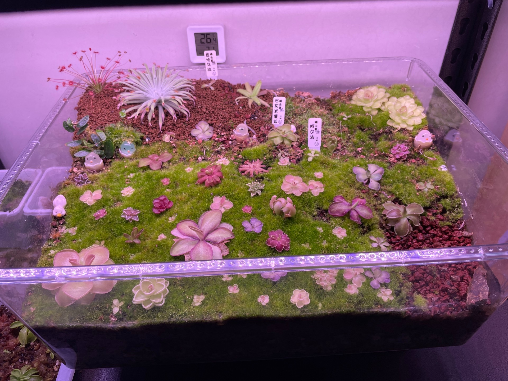

食虫植物(carnivorous plant)

[中国科普网-捕蝇草](https://www.kepuchina.cn/wiki/ct/201903/t20190320_1028701.shtml)

# 病害

https://micro-oasis.com/posts/venus-flytrap-turn-black/

#繁殖
(捕蝇草的繁殖方式以及种植要点)[https://www.haohua.com/huayu/54845.html]

## 叶插

[捕蝇草不会叶插？不想花钱买叶插盒？那这贫民玩家版教程适合你看](https://www.bilibili.com/video/BV1xx4y157hz)

666  一个缸

https://www.goofish.com/item?spm=a21ybx.item.itemCnxh.9.5a4d3da6xmzCiG&id=844987536480&categoryId=0
